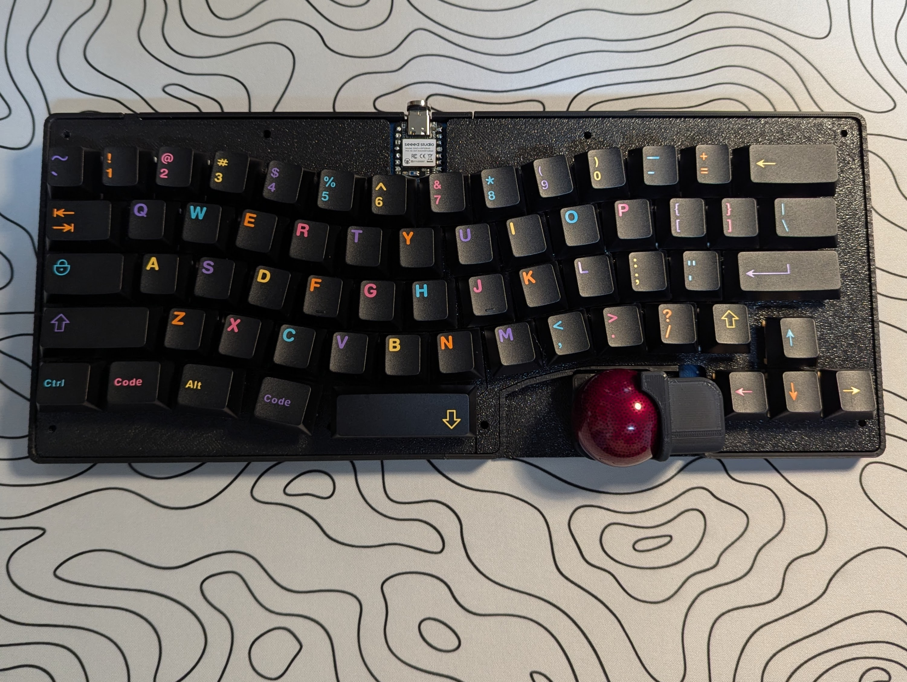
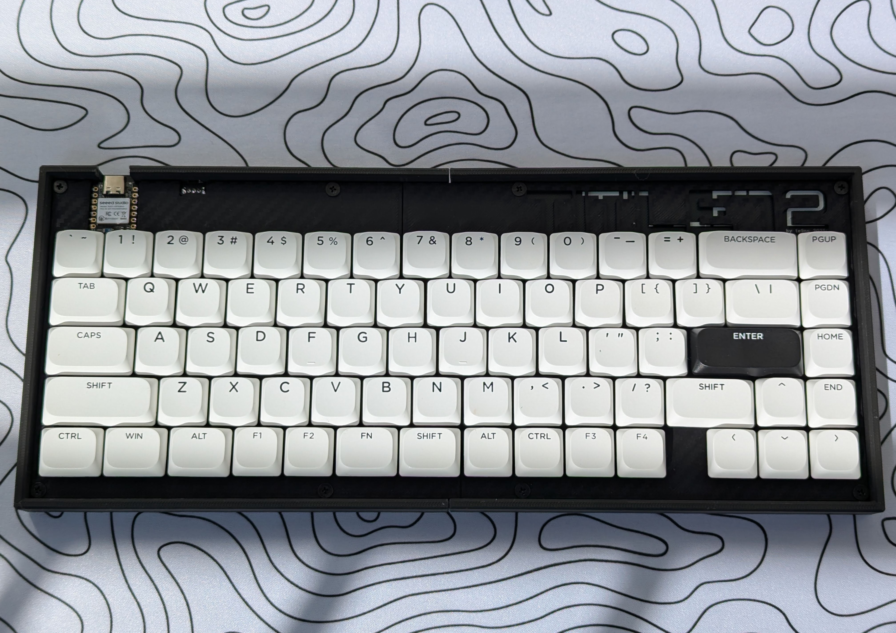
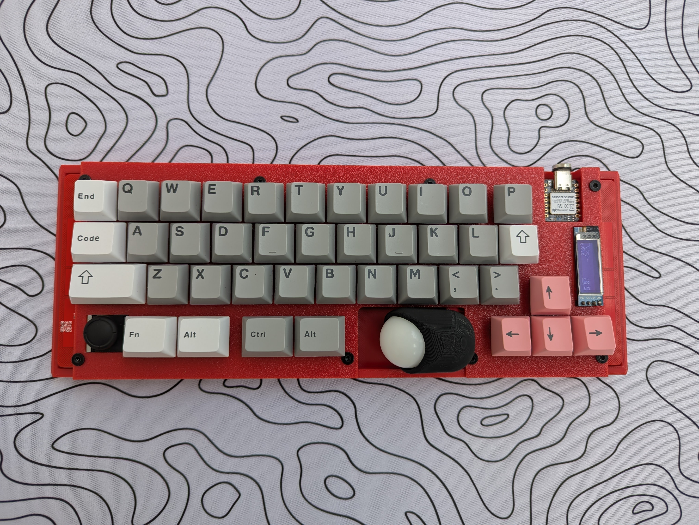

## Hi there 👋
- 🔭 I’m currently working on ZMK.
<!--
**te9no/te9no** is a ✨ _special_ ✨ repository because its `README.md` (this file) appears on your GitHub profile.

Here are some ideas to get you started:

- 🔭 I’m currently working on ...
- 🌱 I’m currently learning ...
- 👯 I’m looking to collaborate on ...
- 🤔 I’m looking for help with ...
- 💬 Ask me about ...
- 📫 How to reach me: ...
- 😄 Pronouns: ...
- ⚡ Fun fact: ...
-->

	

<picture>
  <source media="(prefers-color-scheme: dark)" srcset="https://raw.githubusercontent.com/te9no/te9no/master/img/snake-dark.svg">
  <source media="(prefers-color-scheme: light)" srcset="https://raw.githubusercontent.com/te9no/te9no/master/img/snake.svg">
  
</picture>

## 📚 Zenn
<!-- BLOG-POST-LIST:START -->
- [天下一キーボードわいわい会 Vol.9 見聞録 — 「共鳴層にて」](https://zenn.dev/te9no/articles/6b358b34c878d2)
- [MeKaBu販売の舞台裏 ―― 誰も知らない泥臭い話](https://zenn.dev/te9no/articles/6c22558190ddd5)
- [MeKaBuの始まりと終わりとこれから](https://zenn.dev/te9no/articles/97f50f463a7a7d)
- [MeKaBuキーボード開発記 - 一人のメンバーが語る挑戦と挫折の物語](https://zenn.dev/te9no/articles/6e675b58869dd6)
- [転売をテーマにしたボードゲームを作ってみた話](https://zenn.dev/te9no/articles/78d75fec759bcc)
<!-- BLOG-POST-LIST:END -->

## 🛠️ App
- [KeymapViewer](https://keymap-viewer-test.netlify.app/)
- [USB Serial Monitor-ish](https://usbserialmonitorish.netlify.app/)

## ⌨ Keyboards

- Geacon

- Title72

- Solkatstice

