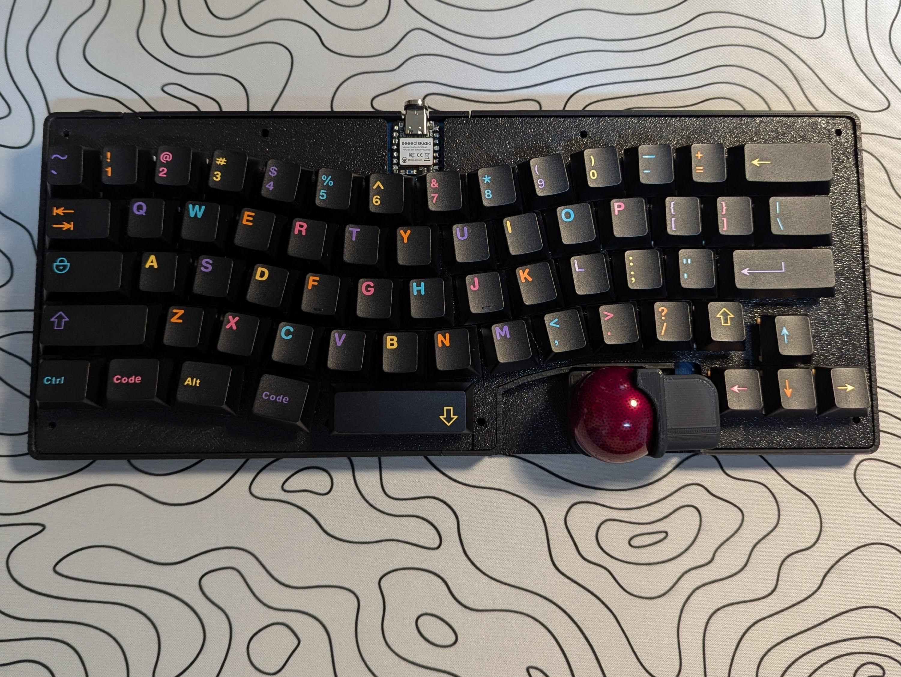
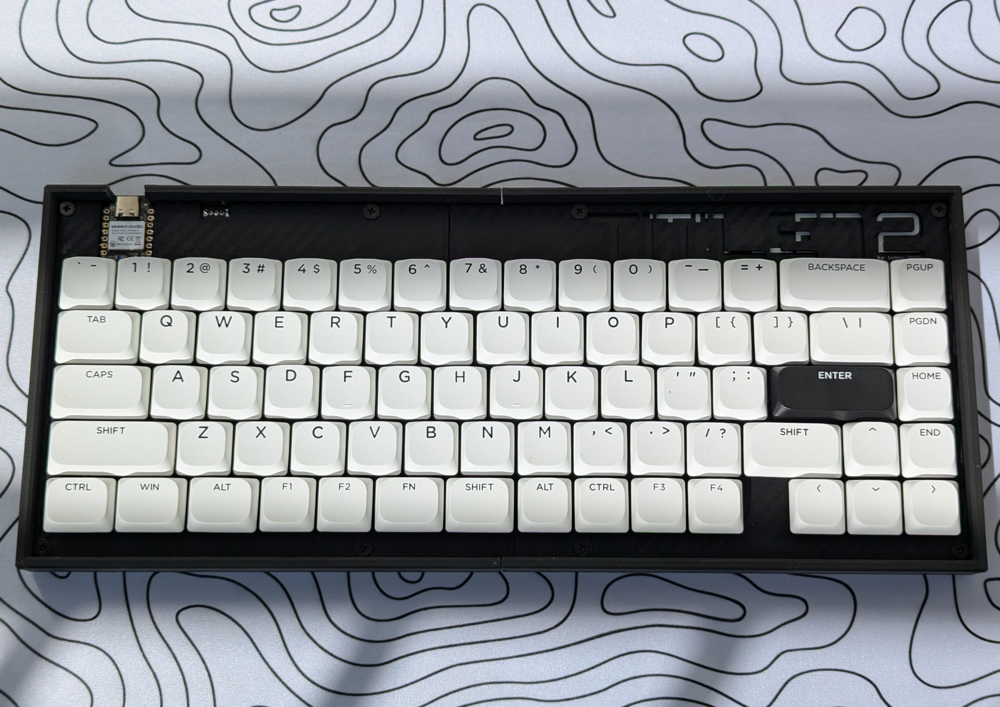
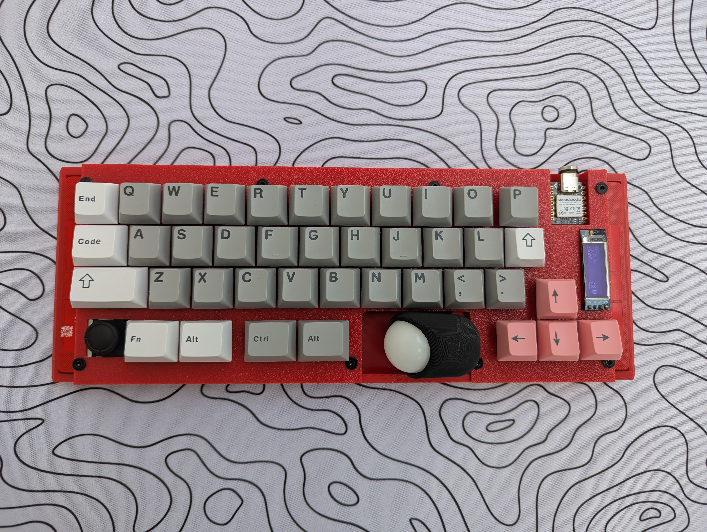

<h1 align="center">te9no</h1>

  <strong>ZMK / custom keyboards / web tools / board games / writing</strong>

  

  
  
  

<picture>
  <source media="(prefers-color-scheme: dark)" srcset="https://raw.githubusercontent.com/te9no/te9no/master/img/snake-dark.svg">
  <source media="(prefers-color-scheme: light)" srcset="https://raw.githubusercontent.com/te9no/te9no/master/img/snake.svg">
  
</picture>

## Now

| Area | What is happening |
| --- | --- |
| Firmware | Working on ZMK and keyboard behavior experiments |
| Hardware | Building and documenting custom keyboard projects |
| Web tools | Shipping small utilities for keymaps and serial workflows |
| Writing | Publishing Zenn notes about keyboards, games, and strange systems |

## Stack

  

  
  
  
  
  

## Apps

| App | What it does | Link |
| --- | --- | --- |
| KeymapViewer | Keyboard layout and keymap viewer | [Open](https://keymap-viewer-test.netlify.app/) |
| ZMK Studio-ish | ZMK Studio-style keyboard configuration experiment | [Open](https://zmk-studio-ish.netlify.app/) |
| USB Serial Monitor-ish | Browser-based serial monitor experiment | [Open](https://usbserialmonitorish.netlify.app/) |
| KittingFlow | Kitting workflow helper | [Open](https://kittingflow.netlify.app/) |
| XIAO Plus Pin Designer | Pin layout designer for XIAO Plus builds | [Open](https://te9no.github.io/xiao-plus-pin-designer/) |
| NarehatePlayground | Narehate project playground | [Open](https://te9no.github.io/NarehatePlayground/) |

## Zenn

<!-- BLOG-POST-LIST:START -->
- [Solstice至話から分割界へ──そして、なれはてぷれいぐらうんどの現在](https://zenn.dev/te9no/articles/d1878ae36aaf26)
- [SparAkasha — Split into the Lotus.](https://zenn.dev/te9no/articles/c1ca8fad8f47f6)
- [天下一キーボードわいわい会 Vol.9 見聞録 — 「共鳴層にて」](https://zenn.dev/te9no/articles/6b358b34c878d2)
- [転売をテーマにしたボードゲームを作ってみた話](https://zenn.dev/te9no/articles/78d75fec759bcc)
- [別紙：Farcaress: Futhesia Parasitic Module - ファルカレス: 寄生型モジュール](https://zenn.dev/te9no/articles/f1205761056a4e)
<!-- BLOG-POST-LIST:END -->

## Keyboard Gallery

<table>
  <tr>
    <td align="center" width="33%">
       
      <strong>Geacon</strong>
    </td>
    <td align="center" width="33%">
       
      <strong>Title72</strong>
    </td>
    <td align="center" width="33%">
       
      <strong>Solkatstice</strong>
    </td>
  </tr>
</table>

## GitHub Dashboard

  

  
  

  
  

  

## Quick Links

  
  
  
  
  
  
  
  

